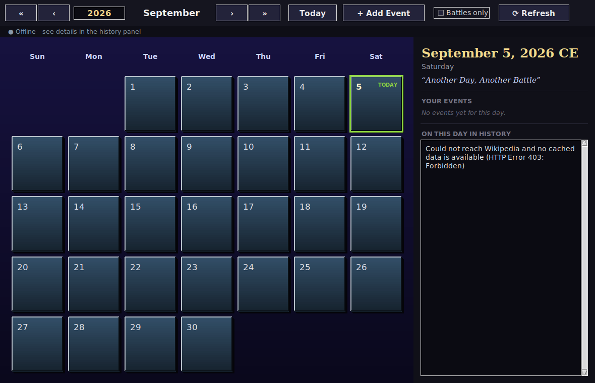

# HistoryCal — The Infinite Battle Calendar

By [Saurav Kushwaha](https://github.com/authorsauravkushwaha)

A desktop calendar app, written in **pure Python** (standard library only —
no `pip install` needed), that does three things at once:

1. **Tracks your own birthdays and events**, stored locally, that repeat
   every year automatically.
2. **Shows a real historical "on this day" event for whatever date you're
   looking at** — battles, wars, treaties, and other turning points from
   world history — pulled from Wikipedia's free public API.
3. **Has no fixed date range.** Most calendar apps only work within a
   normal human lifetime of years. This one lets you type a year like
   `-12000` (12,001 BCE) or `999999999` and press Enter — it just works,
   because the date math underneath isn't borrowed from a library with
   built-in limits, it's built from scratch in this project.



## Why this project exists

This is a learning project — the goal was to build something with a
genuinely hard, interesting problem inside it (calendar math that never
runs out of room) wrapped in a polished, presentable app, rather than
another to-do list. Every module below has a matching automated test that
explains *why* it's correct, not just *that* it runs.

## Features

- 📅 Month grid with a pseudo-3D "war medal" look — gradients, drop
  shadows and bevelled edges drawn entirely with Tkinter's `Canvas`
  (no images, no extra libraries).
- ♾️ **Unbounded year range**, including BCE dates, using a hand-written
  proleptic-Gregorian calendar engine (see `historycal/calendar_math.py`).
- 🎂 Add birthdays/anniversaries/personal events; recurring ones show up
  every year automatically, forever, in both directions of time.
- ⚔️ "On This Day in History" panel, sourced live from Wikipedia's
  [REST API](https://en.wikipedia.org/api/rest_v1/), with a "Battles
  only" filter and a local cache so it stays fast and works offline
  after the first visit to a given day.
- 🎨 A unique colour mood and flavour caption generated **deterministically**
  for every calendar day (same day always looks the same; different days
  look different) — no images or internet needed for this part.
- 🧪 28 automated tests, cross-validating the calendar math against
  Python's own trusted `datetime` module across ~99,000 sample dates.

## Getting started

```bash
git clone https://github.com/authorsauravkushwaha/historycal.git
cd historycal
python main.py
```

(On some systems the command is `python3` instead of `python` — if
`python main.py` says "command not found," just use `python3 main.py`.)

That's it — there is nothing to `pip install`. Requires Python 3.9+.
(Tkinter ships with the standard Python installer on Windows and macOS.
On Linux, if you see "No module named tkinter", install it with e.g.
`sudo apt install python3-tk`.)

### Running the tests

```bash
python run_tests.py
```

## Project layout

```
historycal/
├── main.py                 # entry point — run this
├── run_tests.py             # runs every test suite
├── historycal/
│   ├── calendar_math.py     # the infinite-date engine (see below)
│   ├── storage.py           # local JSON storage for your events
│   ├── history_api.py       # Wikipedia "on this day" fetch + cache
│   ├── theme.py              # per-day colour palettes + 3D canvas drawing
│   └── ui.py                 # the Tkinter application
├── tests/                   # one test file per module above
└── data/                    # created on first run: your events + history cache
```

## How the "infinite calendar" actually works

Python's built-in `datetime` module only supports years 1–9999. To go
further in both directions, `calendar_math.py` represents every date as a
single integer — the number of days since 1970-01-01 (negative for
earlier dates) — and converts between `(year, month, day)` and that
integer using a well-known, public-domain algorithm for the *proleptic
Gregorian calendar* (the same approach used internally by C++'s
`<chrono>` library). It's pure integer arithmetic, so:

- there's no accumulating floating-point error,
- it's fast (no loops, just a handful of divisions per date), and
- Python integers have no size limit, so neither does the calendar.

Year `0` in this system means `1 BCE`, year `-1` means `2 BCE`, and so on
("astronomical" year numbering) — `format_year()` converts that back to
the familiar "123 BCE" / "2026 CE" style for display.

This was also the source of the trickiest bug during development: the
textbook version of this algorithm is written for C++, where integer
division *truncates toward zero*. Python's `//` operator is a *floor*
division (rounds toward negative infinity) — copying the C++ version's
workarounds for negative numbers on top of Python's already-correct floor
division actually introduced an off-by-one-day bug for about half of all
negative years. The fix, and the test that caught it, are both in the
code and worth reading if you want to see how easy it is for "well-known
algorithm from the internet" to still need adapting to your language.

## Where the historical data comes from — and its limits

The "on this day" feature uses Wikipedia's free `onthisday` REST endpoint,
queried by **month and day only** (not year) — which is exactly why it
works for any date you navigate to, past or future: it's always answering
"what happened on this calendar day across history?" There's no complete,
free database of "every battle fought by every country," so this project
uses Wikipedia's curated history feed as an honest, practical stand-in —
it includes a great many wars, battles, sieges and treaties, but it isn't
literally exhaustive. The "Battles only" checkbox filters the day's
events down to war-related entries using a keyword list in
`history_api.py`, which you're welcome to extend.

## Ideas for extending this project

- Add other language Wikipedias (`historycal/history_api.py`'s
  `API_TEMPLATE`) to get a different country's perspective on the same day.
- A "week view" or "year at a glance" mode.
- Export your events to a `.ics` calendar file.
- Swap the pseudo-3D Canvas rendering for a real OpenGL-based 3D view
  using `pygame`/`PyOpenGL` (this would require `pip install`, trading
  away the "zero dependencies" property for literal 3D geometry).

## Author

**Saurav Kushwaha** — [github.com/authorsauravkushwaha](https://github.com/authorsauravkushwaha)

## License

MIT — see `LICENSE`.
